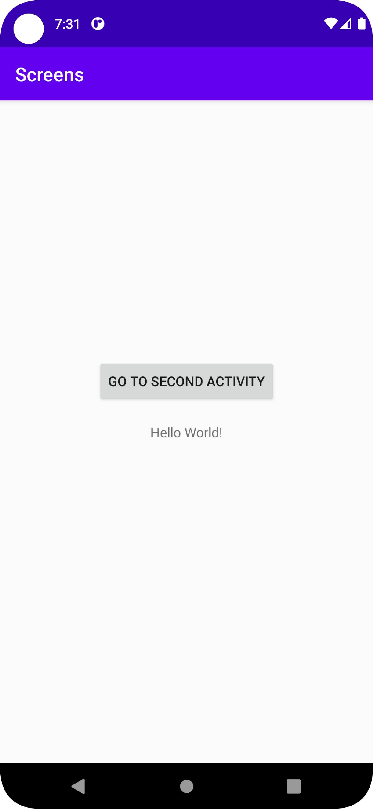
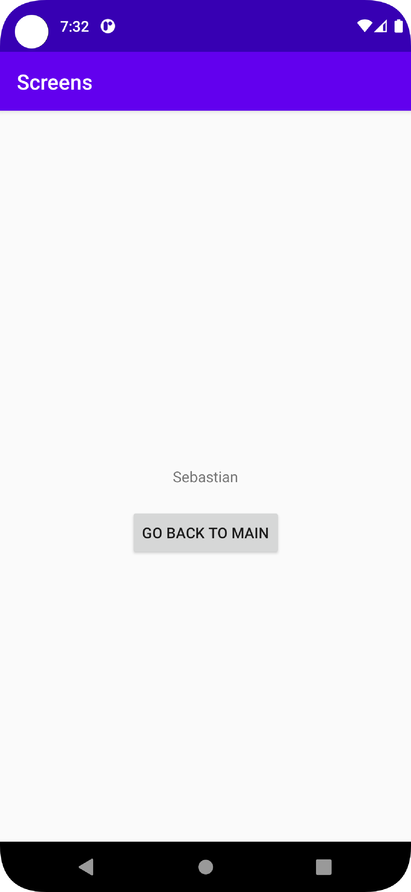

# Rapport

**Skriv din rapport här!**
Skapade en ny Layout för den andra activityn.
Lade till en knapp och en text view i den acivityn.
Lade till en knapp i main Acitivity.
Skapade SecondActivity classen
Lade till kod i MainAcitivity som gör att när man klickar på knappen så startas SecondActivity

```Java
        mainButton.setOnClickListener(new View.OnClickListener() {
            @Override
            public void onClick(View view) {
            clickToSecondActivity();
            }
        });
    }
    void clickToSecondActivity(){
        Intent myIntent = new Intent(this, SecondActivity.class);
        myIntent.putExtra("name","Sebastian");
        startActivity(myIntent);

    }

```
I metoden clickToSecondActivity skapas ett intent och skickar med Sebastian, mitt namn, till SecondActivity.
I SecondActivity, tar emot nyckeln och värdet och visar det i textViewn som skapades ibörjan.
```Java
        secondTextView = findViewById(R.id.SecondActivityTextView);
        final String name = getIntent().getExtras().getString("name");
        secondTextView.setText(name);

```

Kopplade knappen i SecondActivity till att stänga SecondActivity och gå tillbaka till MainAcitivity.
```Java
        mySecondButton.setOnClickListener(new View.OnClickListener() {
            @Override
            public void onClick(View view) {
                goBackToMain();
            }
        });
    }
    void goBackToMain(){
        finish();
    }
```
Bilder på appen:



